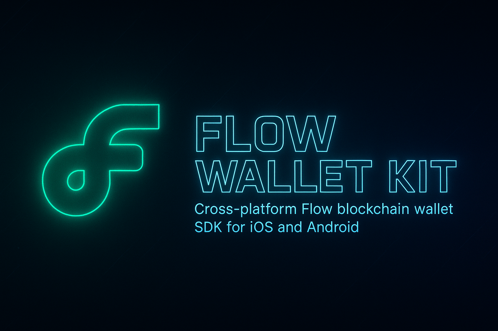

[![DeepWiki](https://img.shields.io/badge/DeepWiki-onflow%2FFlow--Wallet--Kit-blue.svg?logo=data:image/png;base64,iVBORw0KGgoAAAANSUhEUgAAACwAAAAyCAYAAAAnWDnqAAAAAXNSR0IArs4c6QAAA05JREFUaEPtmUtyEzEQhtWTQyQLHNak2AB7ZnyXZMEjXMGeK/AIi+QuHrMnbChYY7MIh8g01fJoopFb0uhhEqqcbWTp06/uv1saEDv4O3n3dV60RfP947Mm9/SQc0ICFQgzfc4CYZoTPAswgSJCCUJUnAAoRHOAUOcATwbmVLWdGoH//PB8mnKqScAhsD0kYP3j/Yt5LPQe2KvcXmGvRHcDnpxfL2zOYJ1mFwrryWTz0advv1Ut4CJgf5uhDuDj5eUcAUoahrdY/56ebRWeraTjMt/00Sh3UDtjgHtQNHwcRGOC98BJEAEymycmYcWwOprTgcB6VZ5JK5TAJ+fXGLBm3FDAmn6oPPjR4rKCAoJCal2eAiQp2x0vxTPB3ALO2CRkwmDy5WohzBDwSEFKRwPbknEggCPB/imwrycgxX2NzoMCHhPkDwqYMr9tRcP5qNrMZHkVnOjRMWwLCcr8ohBVb1OMjxLwGCvjTikrsBOiA6fNyCrm8V1rP93iVPpwaE+gO0SsWmPiXB+jikdf6SizrT5qKasx5j8ABbHpFTx+vFXp9EnYQmLx02h1QTTrl6eDqxLnGjporxl3NL3agEvXdT0WmEost648sQOYAeJS9Q7bfUVoMGnjo4AZdUMQku50McDcMWcBPvr0SzbTAFDfvJqwLzgxwATnCgnp4wDl6Aa+Ax283gghmj+vj7feE2KBBRMW3FzOpLOADl0Isb5587h/U4gGvkt5v60Z1VLG8BhYjbzRwyQZemwAd6cCR5/XFWLYZRIMpX39AR0tjaGGiGzLVyhse5C9RKC6ai42ppWPKiBagOvaYk8lO7DajerabOZP46Lby5wKjw1HCRx7p9sVMOWGzb/vA1hwiWc6jm3MvQDTogQkiqIhJV0nBQBTU+3okKCFDy9WwferkHjtxib7t3xIUQtHxnIwtx4mpg26/HfwVNVDb4oI9RHmx5WGelRVlrtiw43zboCLaxv46AZeB3IlTkwouebTr1y2NjSpHz68WNFjHvupy3q8TFn3Hos2IAk4Ju5dCo8B3wP7VPr/FGaKiG+T+v+TQqIrOqMTL1VdWV1DdmcbO8KXBz6esmYWYKPwDL5b5FA1a0hwapHiom0r/cKaoqr+27/XcrS5UwSMbQAAAABJRU5ErkJggg==)](https://deepwiki.com/onflow/Flow-Wallet-Kit)
# 🚀 Flow Wallet Kit

A cross-platform SDK for integrating **Flow blockchain wallet** functionality into iOS and Android applications. This SDK provides a **secure interface** for managing Flow accounts and handling transactions across networks.

---

## 🗺️ Roadmap

Here's what's been built and what's coming next:

### ✅ Done
- [x] 🔐 Create and store private key
- [x] 🔑 Support multiple private key types
- [x] 🌐 Handle Flow accounts across networks
- [x] 🧩 Manage COA (Cadence Owned Account)
- [x] 👶 Manage child accounts

### 🔜 To Do
- [ ] 💰 Token balance querying
- [ ] ☁️ All-type backup support (e.g. cloud)
- [ ] 🌐 WalletConnect integration
- [ ] 🔄 FCL (Flow Client Library) support
- [ ] ⛓️ Multi-chain support for other blockchains
---

## 📚 Documentation

Visit our comprehensive documentation at [flow-wallet-kit.vercel.app/docs](https://flow-wallet-kit.vercel.app/docs)

Platform-specific guides are also available here:
- 📱 [iOS Documentation](iOS/README.md)
- 🤖 [Android Documentation](Android/README.md)

---

## 🔐 Hardware-Backed Key Security

We prioritize **secure private key handling** using platform-native secure hardware modules:

- 🧱 **Secure Enclave (iOS)**: Flow private keys can be securely generated and stored in the Secure Enclave using the `SecureElementProvider`.
- 🛡️ **Android Keystore (Android)**: Private keys are protected with hardware-backed Android Keystore using the `HardwareBackedStorage` implementation.

These solutions help prevent private key extraction and elevate the security standard for mobile Flow wallets.

---

## 🏗️ Architecture

Check out the full docs in here: [Architecture](./docs/architecture.md)

### 🧱 Core Components
- **Storage Protocol**: Secure data storage across platforms
- **Key Protocol**: Consistent key management
- **Crypto**: Secure encryption, derivation, hashing
- **Wallet**: Modular wallet handling
- **Account**: Multi-network and child account management
- **Security**: Hardware + software crypto implementations
- **Network**: Key Indexer API integration

---

## ✅ Features

### 🔐 Security & Storage
- **Secure Storage Protocol** (platform-agnostic)
  - **iOS**:
    - 🔑 `KeychainStorage`: Secure key storage via Keychain
    - 📁 `FileSystemStorage`: Encrypted file-based storage
  - **Android**:
    - 🛡️ `HardwareBackedStorage`: Uses Android Keystore
    - 📁 `FileSystemStorage`: Encrypted file-based storage
    - 🧠 `InMemoryStorage`: Volatile, memory-only storage
  - ✨ Common:
    - Cacheable interfaces
    - Encrypted storage
    - Hardware-backed protection (when available)

- **Key Management Protocol**
  - 🔐 `PrivateKeyProvider`: Supports ECDSA P-256 & secp256k1
  - 🧱 `SecureElementProvider`: Secure Enclave / Keystore
  - 🌱 `SeedPhraseProvider`: BIP-39 + HD Wallet

- **Backup**
  - 🔒 Platform-specific basic secure backups

### 🔒 Cryptographic Operations
- **Encryption**
  - AES-GCM & ChaCha20-Poly1305
- **Key Derivation**
  - BIP-39 & HD Wallet support
- **Hashing**
  - Secure data integrity functions

### 👛 Core Wallet Types
- **Watch Wallet**: Address-only
- **Key Wallet**: Private key or seed phrase + 🔍 Key Indexer API integration

### 👥 Account Management
- Multi-account, cross-network support
- Child account management
- 🔁 Flow-EVM account compatibility

---

## 🧪 Development Status

This SDK is **under active development**! 🛠️  
We're focused on robust cross-platform key and account management. More features like balance queries and WalletConnect are on the way!

---

## 📄 License

This project is licensed under the MIT License - see the [LICENSE](LICENSE) file for details.

---

## 💬 Support

Found a bug? Need help?  
Please open an issue in the repo or contact the maintainers.
